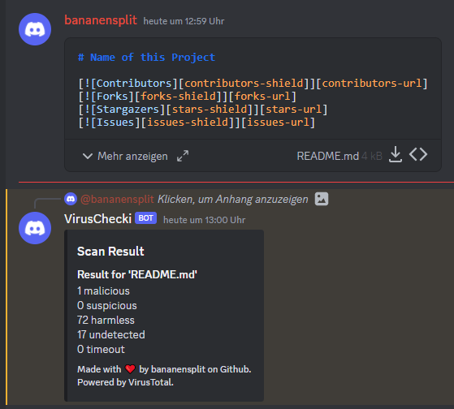

# VirusChecki Discord Bot

[![Contributors][contributors-shield]][contributors-url]
[![Forks][forks-shield]][forks-url]
[![Stargazers][stars-shield]][stars-url]
[![Issues][issues-shield]][issues-url]
[![MIT License][license-shield]][license-url]
[![LinkedIn][linkedin-shield]][linkedin-url]


## A discord bot that scans files for viruses using the [VirusTotal-API](https://www.virustotal.com/)

VirusChecki is a discord bot that uses the [VirusTotal-API](https://www.virustotal.com/) to check all files sent in a discord server for malicious content. VirusChecki was written in Python using the Discord-API wrappers [discord.py](https://github.com/Rapptz/discord.py) and [pycord](https://docs.pycord.dev/en/stable/). VirusChecki works by listening for new messages and checking if these new messages have attachments. If the messages have attachments, VirusChecki will submit them to VirusTotal for a malware-scane where they are scanned with multiple antivirus engines. The result of these scans is then returned by the bot in form of a reply to the original message.

**Disclaimer**
Altough VirusTotal is very reliable, this doesn't mean that every file that is marked as 'harmless' is actually not infected. Please keep using your brain and if something looks suspicious don't trust it just because this bot didn't detect anything.

A message returned by VirusChecki can look like this:



## Installation

The following section explains how to install this project for production use. If you want to contribute to this project, please look at the [Setup for development](#setup-for-development) section.


### Global Prerequisites

This are things that you need to acquire or install in any case, no matter which installation method you choose:


#### Discord Bot Token

A discord bot token is used by the bot to authenticate itself to discord. You can get one by creating a new application in the [Discord Developer Portal](https://discord.com/developers/applications). After creating a new application, you can create a bot for this application. The bot token can be found in the bot tab of your application.

In the following the bot token will be reffered to as `YOUR DISCORD_TOKEN`.


#### VirusTotal API Key

A VirusTotal API Key is used to communicate with VirusTotal. You can get one by creating a new account on [VirusTotal](https://www.virustotal.com/). After creating a new account, you can find your API Key in the [VirusTotal API Settings](https://www.virustotal.com/gui/user/YOUR_USERNAME/apikey).

In the following the VirsuTotal API Key will be reffered to as `YOUR VIRUSTOTAL_APIKEY`.


#### Discord Guild ID

The discord guild id is used to specify the guild in which the bot should listen for new messages. You can get the guild id by enabling developer mode in discord and then right clicking on the guild icon in the guild list. After right clicking on the guild icon, you can click on the `Copy ID` button to copy the guild id to your clipboard.

In the following the discord guild id will be reffered to as `YOUR GUILD_ID`.


### Installation using `Docker` (recommended)

> **Note:** You need to have [Docker](https://www.docker.com/) installed on your machine. For windows you can use [Docker Desktop](https://www.docker.com/products/docker-desktop).

Replace the placeholders (`<...>`) with the actual values and execute the commands below to install this project using docker. The commands will create a container with the name `viruschecki` and run it in the background.

```powershell
Execute the following commands to install this project using docker:

```powershell
# Clone this repository
git clone https://github.com/bananensplit/VirusChecki.git

# Go into the repository
cd VirusChecki

# build the container
docker build -t viruschecki .

# run the container
docker run -d `
    -e DISCORD_TOKEN=<YOUR DISCORD_TOKEN> `
    -e VIRUSTOTAL_APIKEY=<YOUR VIRUSTOTAL_APIKEY> `
    -e GUILD_ID=<YOUR GUILD_ID> `
    -n viruschecki viruschecki
```


### Manuall installation

Look at the [Setup for development](#setup-for-development) section to see how to manually install this project. Although this is a valid way to install this project, this is not the recommended for production. I strongly recommend using the [Docker](#using-docker) method to install this project for production use.


## Setup for development

This section is for developers who want to contribute to this project. It explains how to setup the project for development.


### Prerequisites

You need to have the following tools installed and information acquired before you can setup this project:

- [Python 3.10](https://www.python.org/downloads/)
    - [virtualenv](https://pypi.org/project/virtualenv/)
- Everything in the section [Global Prerequisites](#global-prerequisites)


### Setup

```powershell
# Clone this repository
git clone https://github.com/bananensplit/VirusChecki.git

# Go into the repository
cd VirusChecki

# Create a virtual environment and activate it
python -m virtualenv venv
& venv/Scripts/activate

# Install the dependencies
pip install -r requirements.txt

# Create a .env file with the necessary environment variables
touche .env
echo DISCORD_TOKEN=<YOUR DISCORD_TOKEN> >> .env
echo VIRUSTOTAL_APIKEY=<YOUR VIRUSTOTAL_APIKEY> >> .env
echo GUILD_ID=<YOUR GUILD_ID> >> .env

# Run the bot
python main.py
```


## Find a bug? Have an idea?

If you find a bug in the source code or a mistake in the documentation, you can help me by submitting an issue in the [Issuetracker][issues-url]. Even better you can submit a Pull Request with a fix.

Furthermore if you have an idea for a new feature, feel free to submit an issue with a proposal for your new feature. Please add as much detail as possible to the issue description. This will help me to understand your idea and to discuss it with you.

**Thanks for making this project better!**


## Contact

Jeremiasz Zrolka - jeremiasz.zrolka@gmail.com
* Twitter: [@jeremiasz_z][twitter-url]
* Instagram: [@jeremiasz_z][instagram-url]
* LinkedIn: [jeremiasz-zrolka][linkedin-url]


<!-- MARKDOWN LINKS & IMAGES -->
[repo]: https://github.com/bananensplit/VirusChecki

[contributors-shield]: https://img.shields.io/github/contributors/bananensplit/VirusChecki.svg
[contributors-url]: https://github.com/bananensplit/VirusChecki/graphs/contributors
[forks-shield]: https://img.shields.io/github/forks/bananensplit/VirusChecki.svg
[forks-url]: https://github.com/bananensplit/VirusChecki/network/members
[stars-shield]: https://img.shields.io/github/stars/bananensplit/VirusChecki.svg
[stars-url]: https://github.com/bananensplit/VirusChecki/stargazers
[issues-shield]: https://img.shields.io/github/issues/bananensplit/VirusChecki.svg
[issues-url]: https://github.com/bananensplit/VirusChecki/issues
[license-shield]: https://img.shields.io/github/license/bananensplit/VirusChecki.svg
[license-url]: https://github.com/bananensplit/VirusChecki/blob/master/LICENSE.md
[linkedin-shield]: https://img.shields.io/badge/-LinkedIn-black.svg?logo=linkedin&colorB=555
[linkedin-url]: https://www.linkedin.com/in/jeremiasz-zrolka-78431021b
[twitter-url]: https://twitter.com/jeremiasz_z
[instagram-url]: https://instagram.com/jeremiasz_z